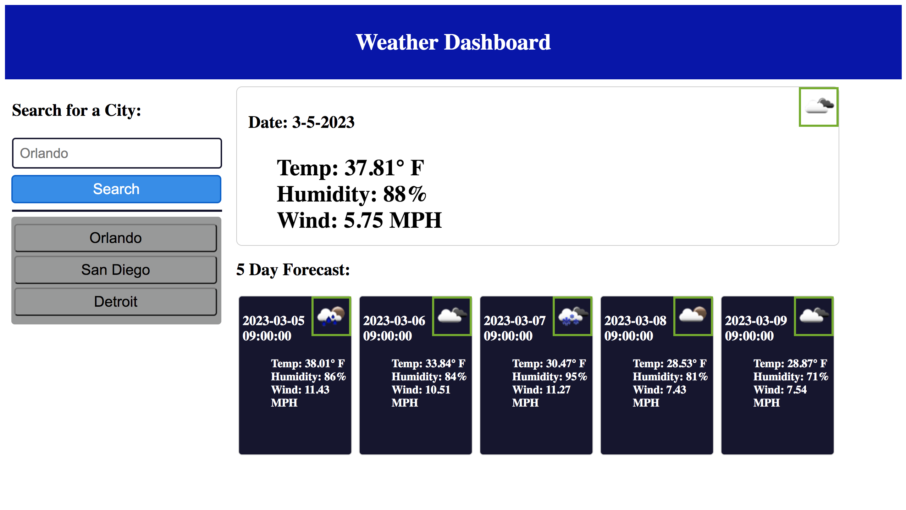

# Module-6-5-Day-Weather-Forecast

## Description
  
This project was created to give a weather forecast for the upcoming work week while also having a recent searches bar for other cities and overall searchbar to find out the forecast for cities in advance. Personally I travel frequently for work and plan my work schedule during regular office hours while working. This application allows me to plan out my travel schedule accordingly right on my laptop. This is could also be useful in trip planning through multiple cities as well, because you would be able to flip between forecasts for multiple cities. In making this project I learned that using jQuery I can recreated css styling dynamically in response to a user's input. This was helpful as it helped me write less code while creating this project.

## Table of Contents

- [Installation](#installation)
- [Usage](#usage)
- [Credits](#credits)
- [License](#license)

## Installation

There are no steps needed for installation. Simply click the link and go to the webpage.

## Usage

Simply type in the city that you would like to see the weather forecast for and the 5 day forecast will appear. The webpage is accesible using the link below.
https://kennedyisn.github.io/Module-6-5-Day-Weather-Forecast
The following screenshot shows the web application's appearance:

## Credits

## License